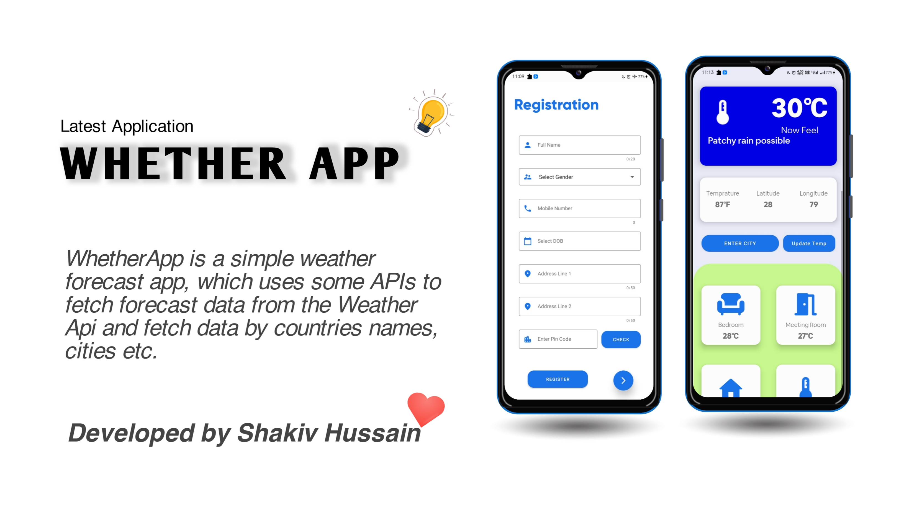

# WeatherApp 🌧

#### 🌧 WeatherApp is a simple weather forecast app, which uses APIs to fetch forecast data from the WeatherApi and fetch data by  places name, cities, counties etc.🔥

- And also uses Indian Postal Api for fetching city details by pinCode.

**Features :**

- Shows the weather status.
- Shows the temperature value (18°C) in Celsius unit.
- uses Indian Postal Api for fetching city details by pinCode.
- Simple Phone number Login to keep the Users Authenticated.

**Highlights**
- Use [Weather Api] API
- Use Material Design 
- Use locale Database

## If you liked the project don't forget to star 🌟 and fork 🍽 the project.

## Connect - Let's become friends:

 
<h2 align="center">Developed by Shakiv Hussain ❤ </h2>			

    
[Weather App]: https://dribbble.com/shots/12869395-Weather-App
[Weather Api]: https://www.weatherapi.com/
